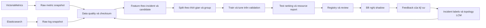

# Benchmark RCA nội bộ cho MANO Core và OCS

Bộ nền **chạy được** để quản lý vòng đời dataset → feature → training → tuning → benchmark → registry → review. Kế thừa cách đánh giá ranking của RCAEval và yêu cầu nghiệp vụ trong ba tài liệu `RCA/`, đồng thời giữ pipeline metric/log độc lập như notebook viễn thông đã có.

**Đầu ra chính:** danh sách entity nghi là nguyên nhân gốc cho mỗi incident, kèm score, evidence, model/config/dataset version. Đây là công cụ benchmark offline và chuẩn bị shadow; kết quả là nghi vấn để kỹ sư kiểm chứng.

## Bắt đầu từ kết quả đã chạy

- [Báo cáo benchmark demo](runs/demo_final/run/report.html)
- [Bảng so sánh thuật toán](runs/demo_final/run/leaderboard.csv)
- [So sánh nguồn dữ liệu](runs/ablation_final/ablation.csv)
- [Hướng dẫn lifecycle](docs/02_lifecycle.md)
- [Dataset, thuật toán và metric đã khảo sát](docs/01_survey.md)
- [Phạm vi đã làm và phần cần dữ liệu thật](docs/07_acceptance.md)

Demo gồm 90 incident/control windows, 8 candidate entities, 3 domain, có propagation, change gây nhiễu và một số case nhiều nguyên nhân. **Mọi điểm số demo đều là synthetic**, chỉ chứng minh đường chạy hoạt động. Không dùng để kết luận mô hình tốt hơn trên mạng thực.

## Chạy nhanh

Python 3.10+ và NumPy là đủ cho cả ba track. Mở terminal trong thư mục này:

```powershell
python -m pip install -e .
python -m unittest discover -s tests -v
python -m rca_bench demo --config configs/demo.json --output runs/my_demo
```

Tên output phải mới; chương trình không ghi đè dataset/run cũ. Trên máy hiện tại, có thể dùng Python đi kèm Codex nếu `python` chưa có trong PATH:

```powershell
$rcaPython = 'C:\Users\anhyd\.cache\codex-runtimes\codex-primary-runtime\dependencies\python\python.exe'
& $rcaPython -m rca_bench demo --config configs/demo.json --output runs/my_demo
```

Không cần cài MLflow, Docker, GPU hay Elasticsearch để chạy demo. Đây là lựa chọn cho bản base dễ kiểm tra; vẫn lưu đầy đủ metadata vào JSON/CSV và SQLite để chuyển sang MLflow/object storage sau này.

## Sáu baseline thực thi

| Track | Thuật toán | Cách dùng trong RCA |
|---|---|---|
| Statistical | `stat_mad` | Xếp hạng độ lệch robust hai phía, cộng evidence log và context tùy cấu hình |
| Statistical | `stat_ewma` | Xếp hạng độ lệch tích lũy, EWMA alpha cố định 0.3 |
| ML | `ml_logistic` | Học xác suất candidate là root từ nhãn incident lịch sử |
| ML | `ml_pca` | Fit normal train, xếp hạng reconstruction error |
| DL | `dl_mlp` | Mạng 2 hidden layers, weighted BCE, Adam, L2 |
| DL | `dl_autoencoder` | Mạng encoder/decoder 3 hidden layers, fit normal train, MSE và Adam |

MLP/AE được huấn luyện bằng NumPy, lưu trọng số thật; không phải placeholder cho PyTorch. Logistic/MLP là **pointwise candidate rankers**, chưa phải pairwise/listwise learning-to-rank. PCA/AE là anomaly-based localization, có thể xếp symptom cao hơn root. RF/XGBoost/Isolation Forest, sequence models và GNN nằm trong survey/roadmap, chưa được gắn nhãn là đã triển khai.

## Luồng dữ liệu



## Cấu trúc thư mục

```text
rca_bench/       code có thực thi: ingestion, data, models, evaluation, runner, registry
configs/        dataset/feature/hyperparameter/source config
catalog/        bảng survey và nguồn đã đối chiếu
docs/           thiết kế, data contract, protocol, runbook, acceptance
examples/       incident, topology, LCM, RCAEval mapping, external prediction
scripts/        chạy demo và kiểm tra phiên bản upstream
tests/          kiểm thử hành vi, chống leakage, connector, end-to-end
runs/           raw/prepared, models, trials, predictions, report, SQLite registry
work/           trích nội dung tài liệu và bản nguồn phục vụ đối chiếu
```

Đã rút gọn `structure_mau.txt` vào các module có chức năng thật. Chưa tạo Kubernetes/Airflow/Terraform trống vì bản base chạy tại một máy; cách nâng cấp được ghi trong runbook.

## Nguồn và giới hạn

RCAEval được đối chiếu tại commit [`bb48c5aa9a24f1d5fcc716bdd479ea2d63145c90`](https://github.com/phamquiluan/RCAEval/tree/bb48c5aa9a24f1d5fcc716bdd479ea2d63145c90). Bản này dùng entity ranking, split nội bộ và preprocessing riêng; **không tuyên bố tái lập điểm số bài báo**. Connector VM/ES có kiểm thử response giả lập, chưa kết nối hạ tầng thật do chưa có endpoint, schema mapping, quyền truy cập và incident Gold. Xem [mapping nguồn](docs/06_sources.md).
